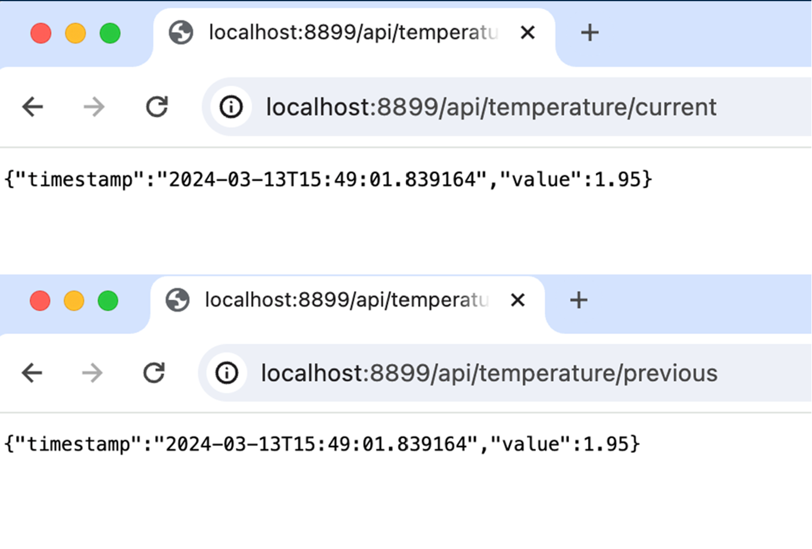
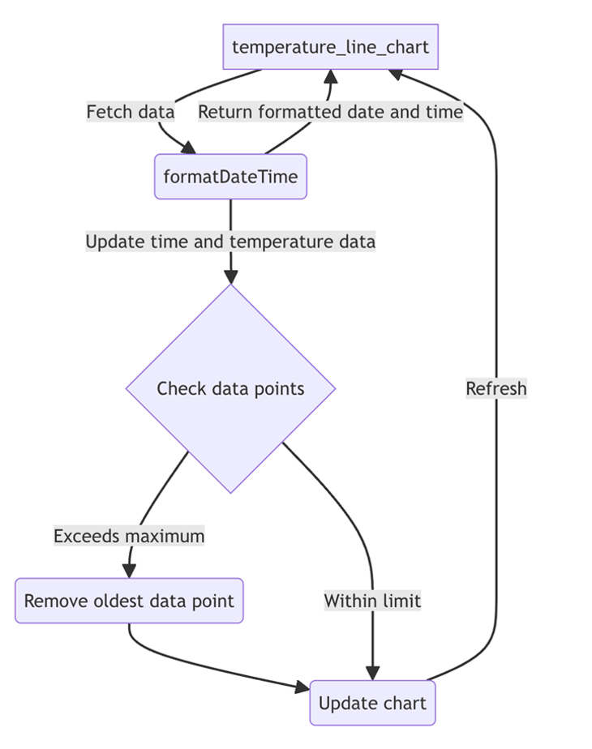
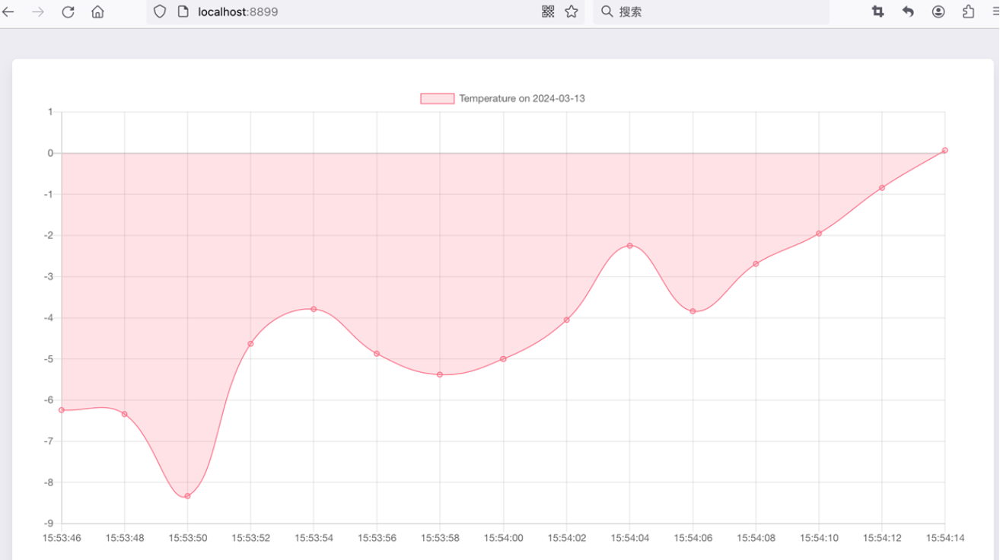
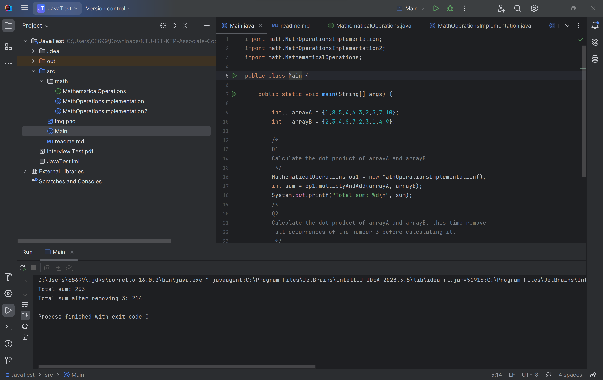

# Integrated Systems Technologies - Temperature System Project  #
## Introduction ##
This is Li Duan's project at [Integrated Systems Technologies Ltd](https://istl.com/). This project includes three parts
    1. Make API Endpoint for two-decimal value returning (JS)
    2. Plot current temperatures on a chart using ChartJS (JS)
    3. Design a method called 'multiplyAndAdd' for mathematical operation (Java)

## JS Coding Task ##
### Make API Endpoint For Two-Decimal Value Returning ###
In class TemperatureService, I added the method toTwoDecimalPlace to return the two-decimal place version of temperatureDT. Then, In the methods getPreviousTemperature and currentTemperature, call toTwoDecimalPlace before returning temperatures. I multiplied temperatureDTO values by 100 and then divided them by 100.0f to get two-decimal values. It is a simple method that does not require complex computations.

Figure: Two Decimal Returning Results

### Plot Current Temperatures On A Chart Using ChartJS
The second task is plotting temperatures by using ChartJS. The frequency is every 2 seconds when displaying values are refreshed. I added temperature to a data array and timestamp to a label array. The oldest data points are removed if more than 15 are in the arrays. This flowchart demonstrates a flowchart for my algorithm. Firstly, data will be fetched from the temperature line chart and processed by formatDateTime, which outputs formatted date and time. The formatDateTime will also update time and temperature data in checkdatapoints. If data points exceed the maximum number (15 in this project), the oldest data point will be removed. The chart will be updated accordingly. The chart will refresh the temperature line chart.

Figure: Plotting Current Temperature Flowchart

This is the plotting result. You can see that the temperature is updated every two seconds, and the oldest data point is removed after data points exceed 15.

Figure: Plotting Temperature Testing Result

## Java Coding Test ##
### Design A MultiplyAndAdd Method For Mathematical Operation ###
This is my implementation of the multiplyAndAdd method. Firstly, A and B array lengths are judged if they are equal. Unequal lengths will result in errors. Then, a variable totalSum is initiated. In the loop, the multiplications of elements in arrays A and B will be added to totalSum. This loop terminates when the last elements in arrays A and B are processed. The totalSum will be returned and printed.

This is the testing result for the multiplyAndAdd method.

Figure MultiplyAndAdd Testing Result

